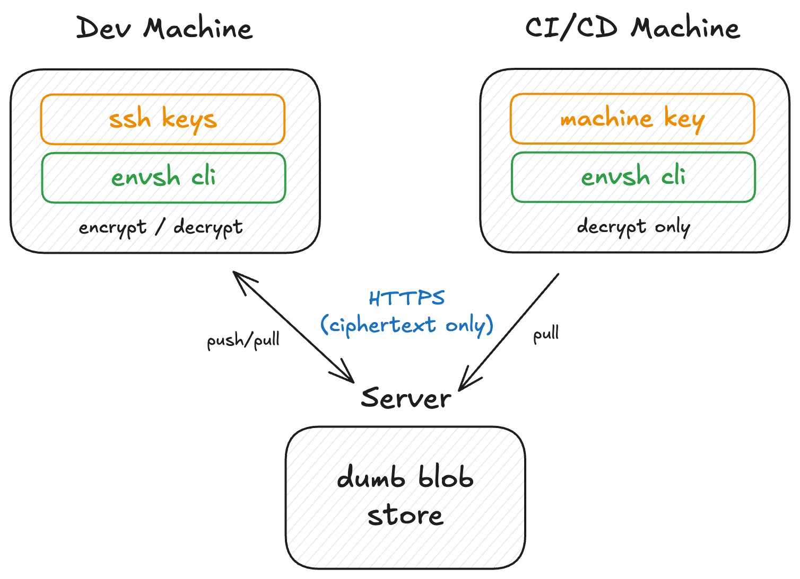

# envsh

Zero-knowledge secret management for teams. The server can't read your secrets — by design, not by promise.

Every team shares `.env` files. Most do it over Slack. envsh encrypts them locally with your SSH keys and syncs the ciphertext. The server is a dumb blob store — it never sees plaintext.

## Install

```bash
curl -fsSL https://envsh.dev/install.sh | sh
```

## Usage

```bash
envsh login                                        # authenticate with email
envsh push .env -p myapp -e production             # encrypt & upload
envsh pull production -p myapp                     # download & decrypt
envsh run production -p myapp -- node server.js    # inject secrets into process
```

## How it works



**Push:** Generate a random AES-256 key, encrypt your `.env` with AES-256-GCM, wrap the AES key once per team member using their SSH public key (ECDH + HKDF + AES-GCM), zero the AES key, upload only ciphertext.

**Pull:** Download the bundle, unwrap the AES key with your SSH private key, decrypt locally, verify checksum, zero the AES key.

The server never touches the AES key or the plaintext. A compromised server leaks nothing usable.

## Teams

```bash
envsh invite alice@company.com                     # add a team member
envsh members                                      # list workspace members
envsh workspace list                               # see all your workspaces
envsh workspace switch WORKSPACE_ID                # switch context
```

## CI/CD

Machine identities for pipelines. Each scoped to one project + one environment, pull-only, 15-minute JWT.

```bash
envsh machine create ci-prod -p myapp -e production
# Set ENVSH_MACHINE_KEY in your CI secrets, then:
envsh run production -p myapp -- ./deploy.sh
```

Works with GitHub Actions, GitLab CI, Bitbucket, CircleCI. [Full guide](https://envsh.dev/guides/cicd/).

## Self-hosting

The server is open source. Run it yourself:

```bash
docker pull ghcr.io/envshq/envsh-server:latest
```

[Self-hosting guide](https://envsh.dev/guides/self-hosting/)

## What's in this repo

- **`cmd/cli/`** — The `envsh` CLI
- **`pkg/crypto/`** — Cryptographic library (AES-256-GCM, Ed25519, X25519, HKDF)
- **`pkg/sdk/`** — Go SDK client

## Links

- [Documentation](https://envsh.dev)
- [Why I Built This](https://envsh.dev/why/)
- [Server repo](https://github.com/envshq/envsh-server)

## License

MIT
